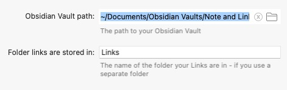
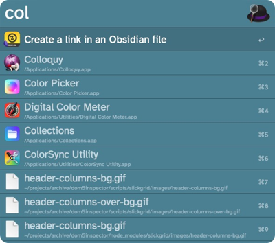
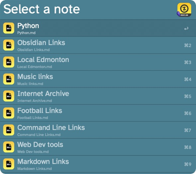

# Create Obsidian Link

## Introduction

The **Create Obsidian Link** workflow has been created to let you use Obsidian as a repository for your URLs and links. Obsidian allows you to create multiple pages and add tags to links making it a much more useful tool, than your browser, at storing URLs and then finding them at a later date.

While it isn't a necessity, you may it helpful to put all of the pages with your links into a single folder. This will limit the number of pages that the Workflow returns to you when you want to save a link. 

##  Requirements

One part of this Workflow requires Python 3 in order to run. 

This Workflow also requires Alfred 5 as well as the [Powerpack](https://www.alfredapp.com/powerpack/) in order to function.

In addition to Obsidian, you will need the [Advanced URI plugin](https://github.com/Vinzent03/obsidian-advanced-uri) for Obsidian installed and active. Details on how to install and activate the plugin are on the Github page or you can also [read the plugin's documentation](https://vinzent03.github.io/obsidian-advanced-uri/). 

## Installation

1. Download the Workflow
2. Double click the `.alfredworkflow` file
3. Follow the instructions to configure the Workflow
4. Install the Advanced URI plugin for Obsidian

## Configuration

The Workflow requires two pieces of information in order to run.

* The path to your Obsidian Vault
* The name of the folder your links are in

The last item is optional but recommended. If you put all of your link pages into a folder it will limit the number of pages that this Workflow returns and make it easier to quickly add a link. 

## Usage

In order to start the Workflow you need to activate Alfred, while your browser is the frontmost app, and type the `obbookmark` keyword.  This can be set to anything that you want. 

The Workflow will show a scrolling list of all of the Markdown pages in your Vault or Links folder if you use one. Select one and then hit Return. 

The Workflow will create a Markdown URL using the data from the frontmost page in the default browser. Currently the action will only work with Safari, Edge, Chrome, Vivaldi, Opera and Brave.  

This URL is then copied to the clipboard.

The Workflow will create an obsidian: format URL that will be parsed by the Advanced URI plugin. This will open the selected page in source mode so you can paste in the URL created earlier. 

## Updates

### 1.3.1

Released June 9th, 2023

#### Changes
* Added Arc to the list of browsers
* Added check to make sure that there is a browser as the frontmost app

### v1.3
Released Jun 2nd, 2023

#### Changes
* changed icon for Markdown files
* changed images in this Readme
* changed name and keyword to match 

### v1.2

Released May 5th, 2023

#### Changes
* removed default browser code and replaced it with frontmost app
* put Keyword trigger back to allow for better UX feedback
* added Chrome Canary support
* new name for the Workflow

### v1.1

Released May 4th, 2023

#### Changes

* fixed an issue where the workflow was showing all of the Obsidian pages twice
* added the ability to get the URL from the default browser and not just Safari
* added support for Safari, Edge, Chrome, Vivaldi, Opera and Brave

### v1.0

Initial release

